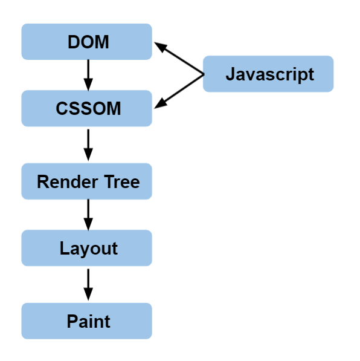
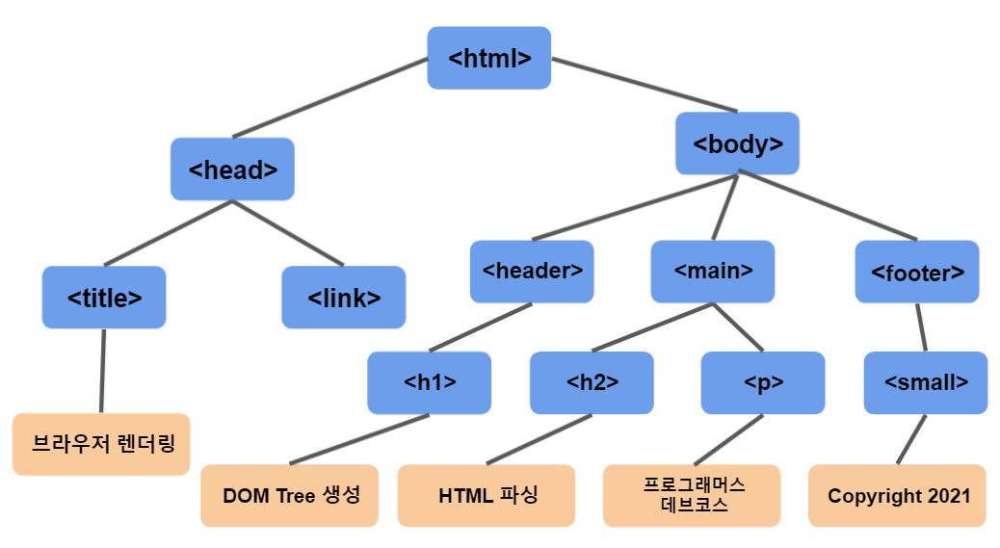
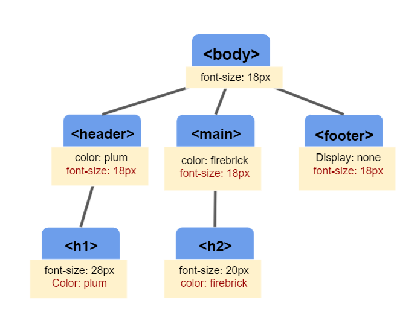
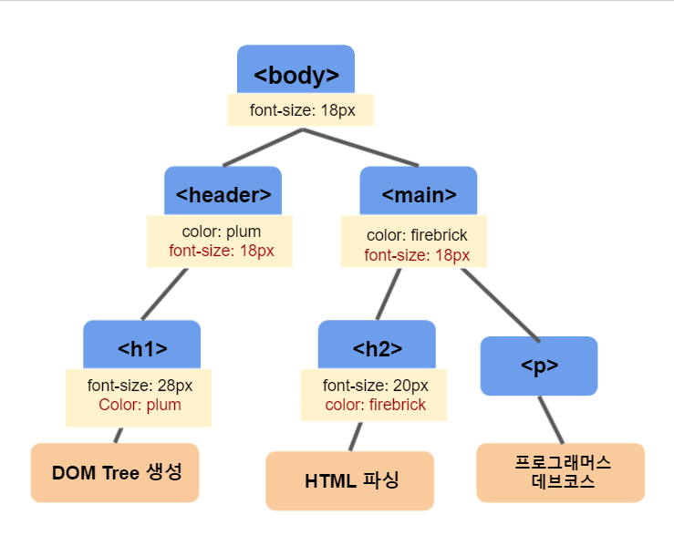

## 브라우저 렌더링

브라우저가 HTML, CSS, Javascript등의 문서들을 화면에 실제 픽셀로 변환하는 동작을 말합니다.

브라우저가 HTML파일을 로드하고 나면 화면에 UI요소를 표시하기 위해 몇가지 변환과정을 거치게 됩니다.



1. HTML 파일을 파싱하여 DOM Tree 생성한다.
2. CSS 파일을 파싱하여 CSSOM Tree 생성한다.
3. DOM Tree와 CSSOM Tree로 Render Tree 생성한다.
4. Render Tree를 바탕으로 화면상의 배치(layout) 결정한다.
5. 화면에 실제 픽셀로 표현(paint)한다.

---

## 1. HTML에서 DOM으로 변환

- HTML 파일을 파싱하여 만들어 낸 트리구조
- `HTMLElement`를 루트로 하여 HTML 각 태그와 속성 텍스트에 대해 노드를 생성하게 된다.
- 각 요소내에 중첩되는 요소들은 자식 노드로 생성된다.
- 각 노드는 해당 요소에 대한 속성을 포함한다.
- **파싱 중에 HTML태그를 만날 떄마다 순차적으로 DOM트리를 구성가능**

다음 예시를 살펴보자.

```html
<html>
  <head>
    <title>브라우저 렌더링</title>
    <link rel="stylesheet" href="style.css" />
  </head>
  <body>
    <header>
      <h1>DOM tree 생성</h1>
    </header>
    <main>
      <h2>HTML 파싱</h2>
      <p>v프로그래머스 데브코스</p>
    </main>
    <footer>
      <small>Copyright 2021</small>
    </footer>
  </body>
</html>
```

위의 HTML 파일은 다음과 같이 DOM tree을 생성한다.



---

## 2. CSSOM 트리 구성

- css 파일을 파싱하여 만들어 낸 트리구조
- CSS 선택자를 이용하여 노드에 접근하고 각 노드에 대한 스타일을 적용한다.
- CSS 파일은 basic style을 상속받기때문에 **CSS파일 전체에 대해 CSSOM을 구성하기 전까지는 렌더링을 중지한다.**
- **CSS는 렌더링 차단요소**

```css
body {
  font-size: 18px;
}

header {
  color: plum;
}

h1 {
  font-size: 28px;
}

main {
  color: firebrick;
}
h2 {
  font-size: 20px;
}

footer {
  display: none;
}
```



---

### 3. 렌더 트리 구성

- DOM와 CSSOM을 결합(attachment)하여 렌더 트리 구성
- 픽셀관련 작업을 하지 않는 노드는 포함하지 않습니다. (Ex. display: none)
- 렌더 트리를 기반으로 Layout(배치)와 paint(화면 출력) 작업을 수행합니다.



---

### 4. Layout(배치)

- 뷰포트(viewport) 내에서 각 노드들의 정확한 위치와 크기를 계산하는 단계입니다.
- 일반적으로 비용이 많이드는 작업이므로 사소한 이유로 Layout작업을 여러번 하는 것은 피해야한다.

> 뷰포트(viewport): 그래픽이 표시되는 브라우저의 영역, 일반적으로 모바일의 경우 디스플레이 너비, 웹의경우 브라우저 창의 너비와 동일
>
> HTML 문서 내에 <meta name=""viewport content="width=devide-width">로 표시 되어 있음


[출처](https://developers.google.com/web/fundamentals/performance/critical-rendering-path/render-tree-construction)

---

### 5. Paint

- render tree의 요소들이 서로 중첩될 수 있고 모양, 위치등을 변경하는 css속성을 갖고 있을수 있기에 **layer**을 생성하는 단계
- 브라우저 윈도우의 스크롤이나 크기 조절같은 상황에 painting 작업을 효율적으로 할수 있게 해준다.
- 각 Layer 내부에서 개별 픽셀을 채운다.

---

## 브라우저 렌더링 최적화

### 1. CSS

CSS는 렌더링 차단요소 -> css파일을 로드, 파싱하여 CSSOM이 구성되기 전까지 렌더링이 차단

- 문서 최상단에 배치
- 미디어 유형과 미디어 쿼리 이용

```html
<link href="style.css" rel="stylesheet" /> // ----- 1
<link href="print.css" rel="stylesheet" media="print" /> //------ 2
<link href="other.css" rel="stylesheet" media="(min-width: 40em)" /> //------- 3
```

1. 미디어 유형이나 미디어쿼리를 적용하지 않았기 때문에 항상 렌더링을 차단
2. 컨텐츠가 print될 때만 렌더링차단. 따라서 처음 선언시 렌더링을 차단할 필요가 없다.
3. 조건이 일치하면 스타일시트가 다운로드되고 처리될 때까지 렌더링 차단.

---

### 2. Javascript

- HTML 파싱 도중 `<script>`태그를 만나면 DOM생성을 중단하고 javascript가 실행되게 한 후 DOM생성을 재개한다.

단, CSSOM이 생성되지 않았다면 CSSOM이 생성될 때 까지 javascript 실행을 중지한다.


#### 해결 방법

- script 태그를 `<body>` 최하단에 위치한다.
- async 속성을 script 태그에 부여
  

- defer 속성을 script 태그에 부여


### 출처

[Website Performance Optimization](https://classroom.udacity.com/courses/ud884)
[How the browser renders a web page? — DOM, CSSOM, and Rendering](https://medium.com/jspoint/how-the-browser-renders-a-web-page-dom-cssom-and-rendering-df10531c9969)
[Critical Rendering Path](https://developers.google.com/web/fundamentals/performance/critical-rendering-path)
