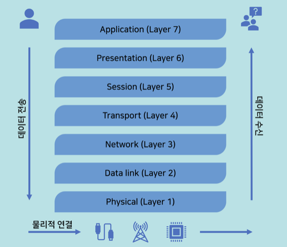
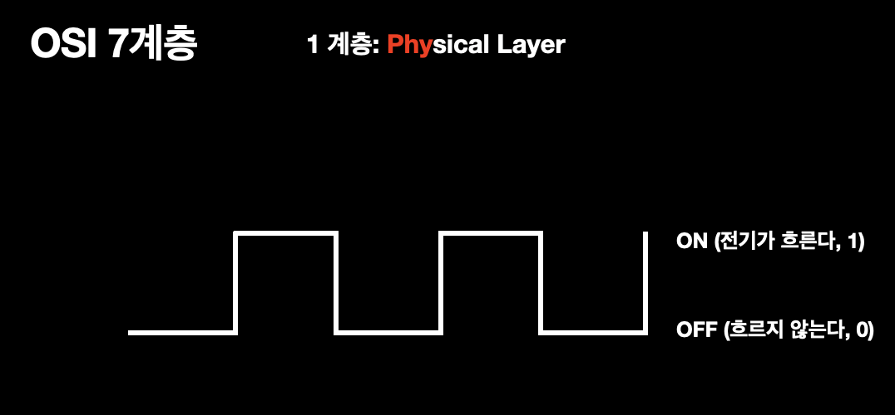
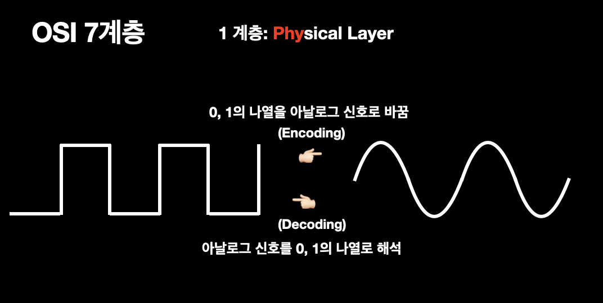
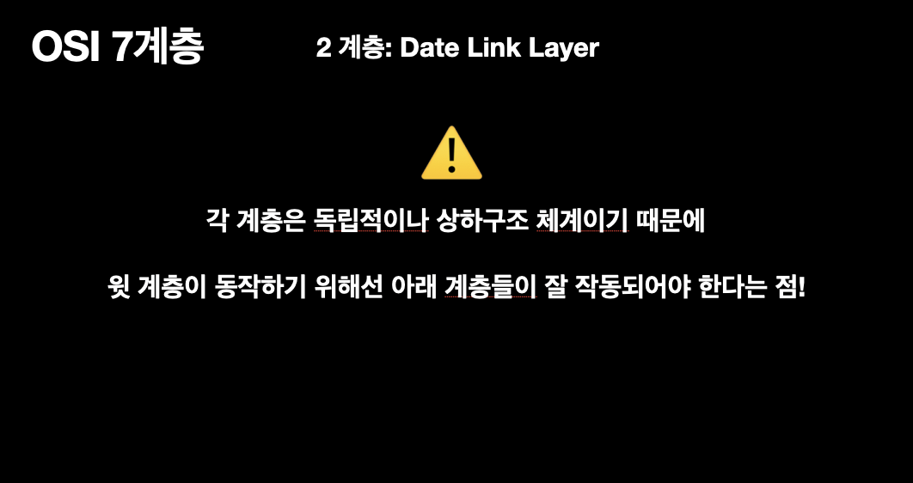
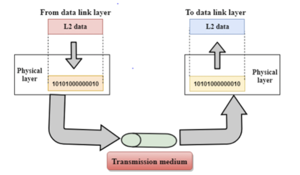
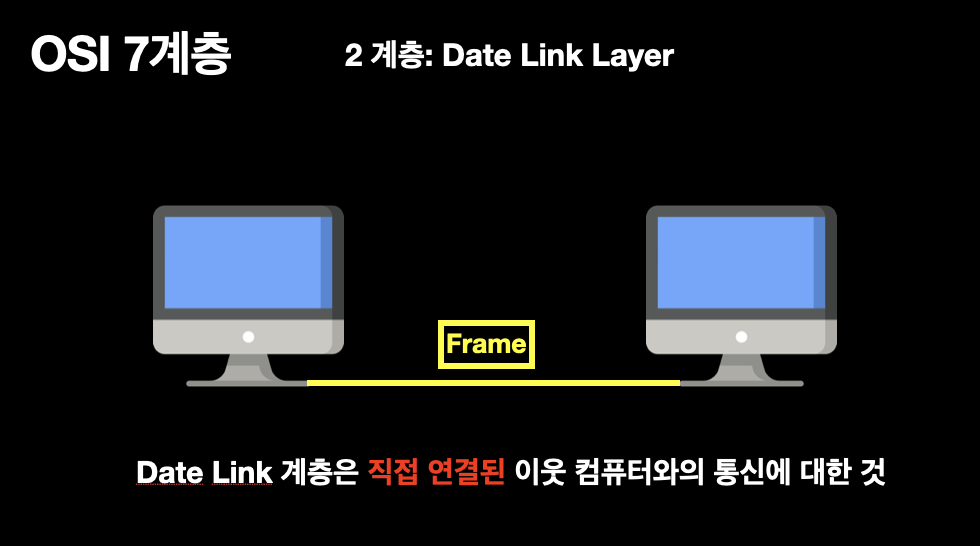
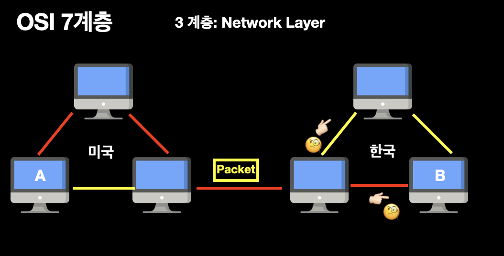
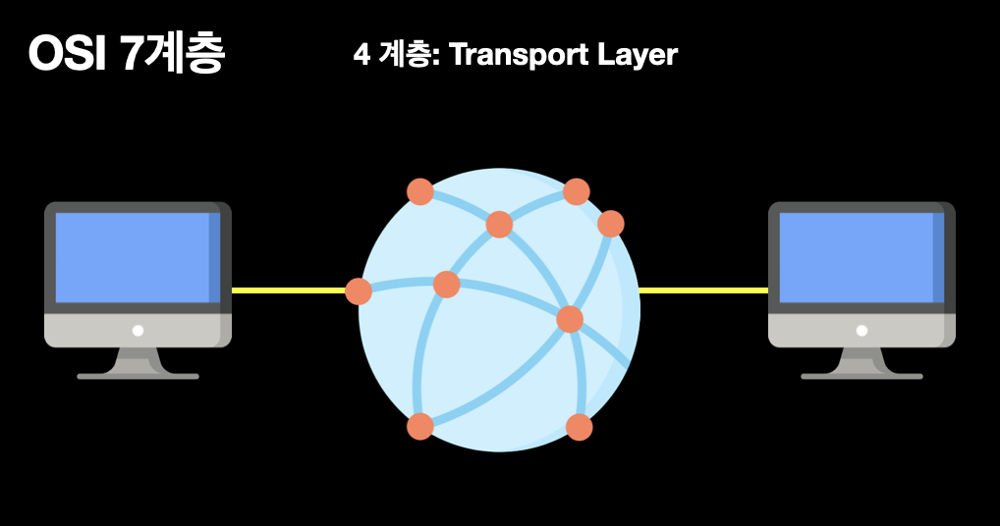
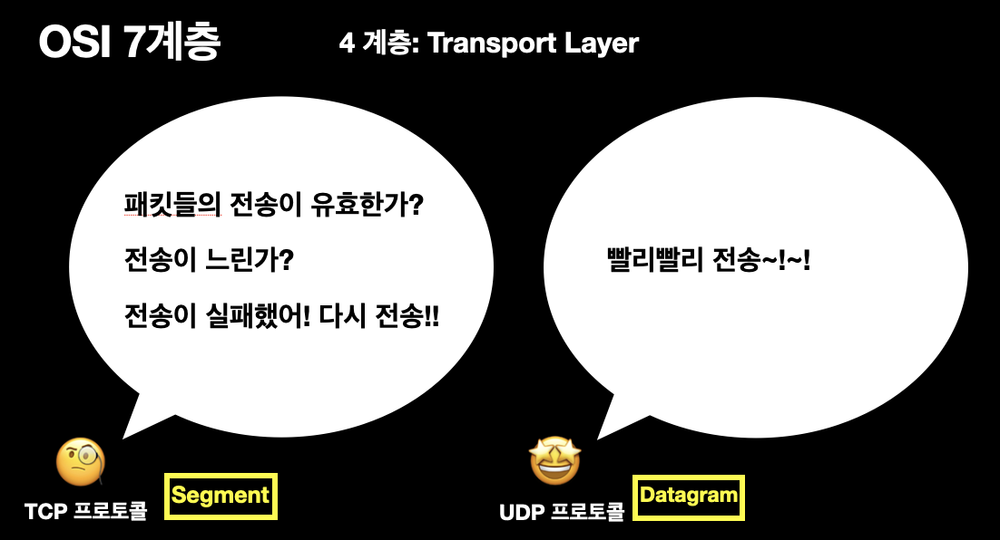

# OSI 7 계층

> Open Systems Interconnection(개방형 시스템 상호연결)의 약자로, **네트워크에서 통신이 일어나는 과정을 7계층으로 나눈 모델**.

 ## 네트워크
 - 하드웨어끼리 마치 그물망처럼 연걸되어 데이터들을 주고 받는 집단.

 OSI 7계층을 이해하기에 앞서 `네트워크`에 대해 이해할 필요가 있다. 네트워크는 일대일 커뮤니케이션에서 원거리 커뮤니케이션의 필요성으로 발달하게 되었다. 기술의 발달로 기존 아날로그 신호가 아닌 전기적 신호를 활용하게 되면서 **마치 여러 대의 기기가 그물망처럼 연결되어 서로 통신**한다는 뜻의 네트워크 구축을 가속화 시켰다. 이 과정에서 1970 - 1980 년대 말까지 많은 대학들과 연구가들은 서로 다른 네트워크들을 연결시키려고 노력했다.

 ## OSI 7계층의 탄생
 이때 탄생된 것이 OSI 7계층이다. 
  

 서로 이질적인 네트워크 간의 연결에 어려움이 많아, 호환성 이슈를 방지하고자 ISO(국제 표준화 기구)에서 OSI 참조모델을 제시하게 된다. 즉, OSI 7계층은 **네트워크를 만들 때, 이것을 참조해서 만들어라 -** 라는 참조모델인 것이다. 	따라서 OSI 7 계층을 이해하면, 네트워크 구성을 예측하고 이해할 수 있다.
	
## 계층 설명
### 1계층 (Physical Layer)
앞서 네트워크를 설명하며 전기적 신호를 이용해 전화나 인터넷을 이용한다고 했는데. 이것이 어떻게 가능할까?

이것에 대해 다루는게 1계층,Physical Layer이다. 

컴퓨터는 `전기가 흐른다(1), 흐르지않는다(0)`는 신호로 데이터를 정의한다. 
하지만 이런 형태의 전자기파는 항상 0, 무한대, 0, 무한대의 주파수 범위를 갖기 때문에 이런 전기적 신호를 통과시킬 수있는 전선은 없다!고 할 수 있다.🧐 따라서 곡선 형태의 아날로그 신호로 변경해줘야 한다.

> 즉 최소 두대의 컴퓨터가 통신하기 위해,
**0, 1의 나열을 아날로그 신호로 바꾸어 전선으로 흘려 보내고, 아날로그 신호를 0, 1의 나열로 해석하는 역할**을 하는 것이 Physical Layer가 하는 역할이다.
- Physical Layer의 미디어 타입은 `유선`으론 구리, 광섬유 등이 있고 `무선`으론 공기도 가능하다.

### 2계층(Data Link Layer)

2계층을 설명하기에 앞서 각 계층은 독립적이지만, 기본적으로 상하구조 체계이기 때문에 **윗 계층이 동작하기 위해선 아래 계층들이 잘 작동해야 함**을 전제로 한다.

사진을 살펴보면, 데이터링크 계층으로부터, physical 계층이 데이터를 전달받아 상대방 컴퓨터로 신호를보내고 있다.

따라서 데이터 계층은 **직접 연결된** 이웃 컴퓨터와의 통신만을 다룬다. 이 계층에서 전송되는 데이터 단위는`프레임`이라 부른다. 직접 연결된 컴퓨터와의 통신만을 다루므로, 이웃의 컴퓨터를 넘어가는 통신은 데이터 링크 계층에선 관여하지 않는다.

데이터 링크 계층은 통신에 오류가 없도록 다양한 역할들을 수행한다.
- `프레이밍`: Physical Layer를 통해 받은 신호를 조합해 Frame 단위의 데이터 유닛으로 만들어 처리
- `흐름제어`: 데이터를 송수신 시, 너무 많거나 너무 적은 데이터를 송수신하지 않도록 흐름제어 
- `오류제어`: 프레임 전송 시 발생한 오류를 복원하거나 재전송
- `접근제어`: 매체 상 통신 주체(장치)가 여러 개 존재할 때, 데이터 전송 여부 결정 
- `동기화`: 프레임 구분자 (특별한 bit 패턴)

이처럼 데이터 링크 계층은 단순히 데이터를 마구잡이로 보내지 않고 **안전하게 보내는 역할**도 수행한다.

### 3계층 (Network Layer)

미국에 있는 A가 한국에 있는 B에게 데이터를 보낼 땐 어떻게 할까?
이것에 대해 다루는 것이 3계층, `네트워크 계층`이다.
> 네트워크 계층은 전송할 데이터를 여러개의 경로를 거쳐 목적지에 전송하는 계층이다.

이 계층에서 전송단위는 `패킷`이라 부른다.
즉 주소(IP)를 정하고 경로를 선택하고, 패킷을 전달하는 것이이 계층에서 이루어지고, 이것을 `라우팅`이라 한다. 라우팅은 네트워크에서 `패킷`을 보낼 때 목적지까지 갈 수 있는 여러경로 중 한 경로를 설정해주는 과정이다.

### 4계층 (Transfer Layer)

이제 우리는 모든 데이터를 송수신할 수 있게 되었다. 하지만 데이터를 주고 받는다고 끝은 아닐 것이다.
> 4계층, Transport 계층에서는  사용자들이 신뢰성있는 데이터를 받을수 있도록 전송 속도를 조절하거나, 오류가 발생하면 맞춰주는 역할을 한다.

헤더에 송, 수신자 포트번호를 포함해 전달하는 계층이 이 계층이기도 하다.

대표적으로 `TCP 프로토콜`과`UDP 프로토콜`이 있다.

`TCP 프로토콜`은 **신뢰성있는 통신을 보장**하고, 신뢰성있는 연결과 전달을 보장하는만큼 계속 연결을 유지해야 해서 그만큼의 리소스가 더 들어간다.
	
반대로, `UDP 프로토콜`은 **빠른 데이터 전송에 초점**을 뒀다. 목적지에 데이터가 제대로 도착했는지는 상관하지 않는다. 따라서 신뢰성있는 데이터 전송보다 스트리밍과 같은 연속적인 특성을 가진 서비스에 UDP 프로토콜이 적합하다고 할 수 있다.

## 참고 사이트
 - [네트워크 기초 - OSI 7계층과 TCP/IP 계층](https://snyung.com/content/2020-08-31--네트워크-기초-OSI-7-계층과-TCP-IP-계층)
- [OSI 7 계층이란?, OSI 7계층을 나눈 이유](https://shlee0882.tistory.com/110)
- [KSA 한국 표준협회 | 주요 국제표준화기구](https://www.ksa.or.kr/ksa_kr/942/subview.do)
- [OSI 7계층 모형](https://hleee.medium.com/osi-7-계층-모형-72019882b01f)
- [네트워크 통신 계층: OSI 7계층 바로 알기](https://www.sharedit.co.kr/posts/7482)
- [네트워크 OSI 7 계층: 물리계층](https://jhnyang.tistory.com/373)
- [10분 데코톡 | 히히의 OSI & Layer](https://www.youtube.com/watch?v=1pfTxp25MA8&t=1905s)

 
