# OSI 7 계층

> Open Systems Interconnection(개방형 시스템 상호연결)의 약자로, **네트워크에서 통신이 일어나는 과정을 7계층으로 나눈 모델**.

 ## 네트워크
 - 하드웨어끼리 마치 그물망처럼 연걸되어 데이터들을 주고 받는 집단.

 OSI 7계층을 이해하기에 앞서 `네트워크`에 대해 이해할 필요가 있다. 네트워크는 일대일 커뮤니케이션에서 원거리 커뮤니케이션의 필요성으로 발달하게 되었다. 기술의 발달로 기존 아날로그 신호가 아닌 전기적 신호를 활용하게 되면서 **마치 여러 대의 기기가 그물망처럼 연결되어 서로 통신**한다는 뜻의 네트워크 구축을 가속화 시켰다. 이 과정에서 1970 - 1980 년대 말까지 많은 대학들과 연구가들은 서로 다른 네트워크들을 연결시키려고 노력했다.

 ## OSI 7계층의 탄생
 이때 탄생된 것이 OSI 7계층이다. 
  
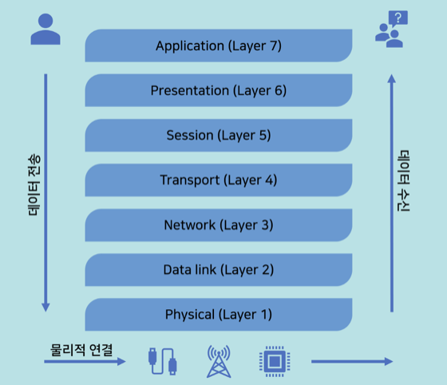

 서로 이질적인 네트워크 간의 연결에 어려움이 많아, 호환성 이슈를 방지하고자 ISO(국제 표준화 기구)에서 OSI 참조모델을 제시하게 된다. 즉, OSI 7계층은 **네트워크를 만들 때, 이것을 참조해서 만들어라 -** 라는 참조모델인 것이다. 	따라서 OSI 7 계층을 이해하면, 네트워크 구성을 예측하고 이해할 수 있다.
	
## 계층 설명
### 1계층 (Physical Layer)
앞서 네트워크를 설명하며 전기적 신호를 이용해 전화나 인터넷을 이용한다고 했는데. 이것이 어떻게 가능할까?

이것에 대해 다루는게 1계층,Physical Layer이다. 

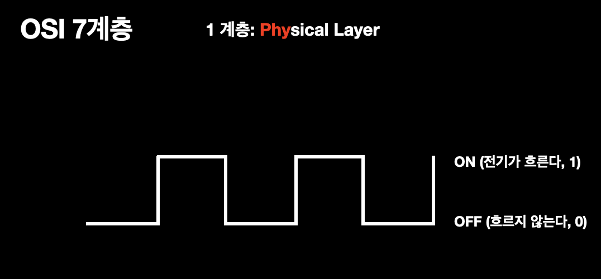

컴퓨터는 `전기가 흐른다(1), 흐르지않는다(0)`는 신호로 데이터를 정의한다. 
하지만 이런 형태의 전자기파는 항상 0, 무한대, 0, 무한대의 주파수 범위를 갖기 때문에 이런 전기적 신호를 통과시킬 수있는 전선은 없다!고 할 수 있다.🧐 따라서 곡선 형태의 아날로그 신호로 변경해줘야 한다.

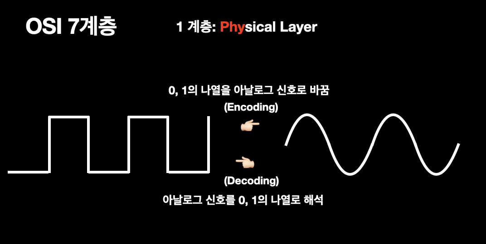

> 즉 최소 두대의 컴퓨터가 통신하기 위해,
**0, 1의 나열을 아날로그 신호로 바꾸어 전선으로 흘려 보내고, 아날로그 신호를 0, 1의 나열로 해석하는 역할**을 하는 것이 Physical Layer가 하는 역할이다.
- Physical Layer의 미디어 타입은 `유선`으론 구리, 광섬유 등이 있고 `무선`으론 공기도 가능하다.

### 2계층(Data Link Layer)

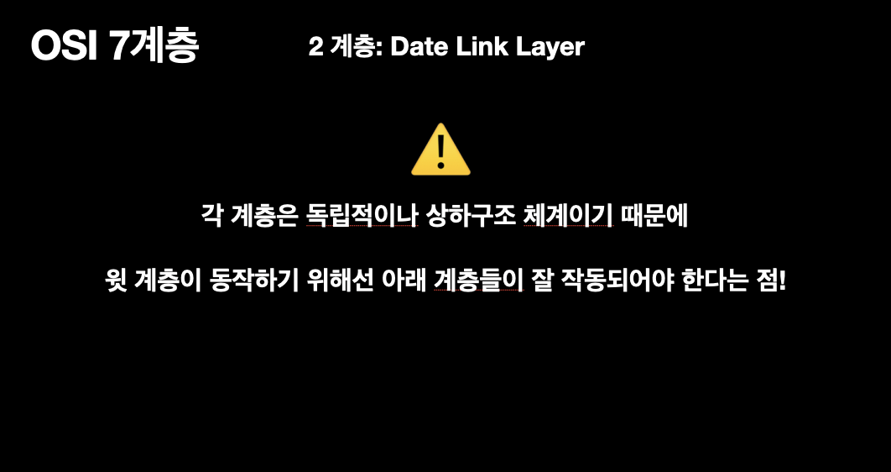

2계층을 설명하기에 앞서 각 계층은 독립적이지만, 기본적으로 상하구조 체계이기 때문에 **윗 계층이 동작하기 위해선 아래 계층들이 잘 작동해야 함**을 전제로 한다.

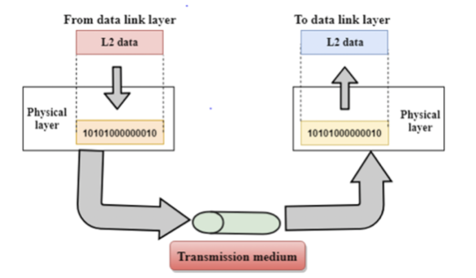

사진을 살펴보면, 데이터링크 계층으로부터, physical 계층이 데이터를 전달받아 상대방 컴퓨터로 신호를보내고 있다.

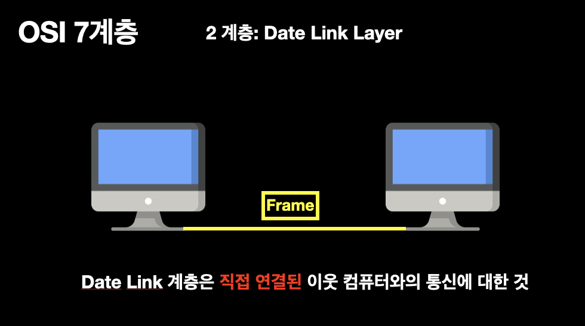

따라서 데이터 계층은 **직접 연결된** 이웃 컴퓨터와의 통신만을 다룬다. 이 계층에서 전송되는 데이터 단위는`프레임`이라 부른다. 직접 연결된 컴퓨터와의 통신만을 다루므로, 이웃의 컴퓨터를 넘어가는 통신은 데이터 링크 계층에선 관여하지 않는다.

데이터 링크 계층은 통신에 오류가 없도록 다양한 역할들을 수행한다.
- `프레이밍`: Physical Layer를 통해 받은 신호를 조합해 Frame 단위의 데이터 유닛으로 만들어 처리
- `흐름제어`: 데이터를 송수신 시, 너무 많거나 너무 적은 데이터를 송수신하지 않도록 흐름제어 
- `오류제어`: 프레임 전송 시 발생한 오류를 복원하거나 재전송
- `접근제어`: 매체 상 통신 주체(장치)가 여러 개 존재할 때, 데이터 전송 여부 결정 
- `동기화`: 프레임 구분자 (특별한 bit 패턴)

이처럼 데이터 링크 계층은 단순히 데이터를 마구잡이로 보내지 않고 **안전하게 보내는 역할**도 수행한다.

### 3계층 (Network Layer)

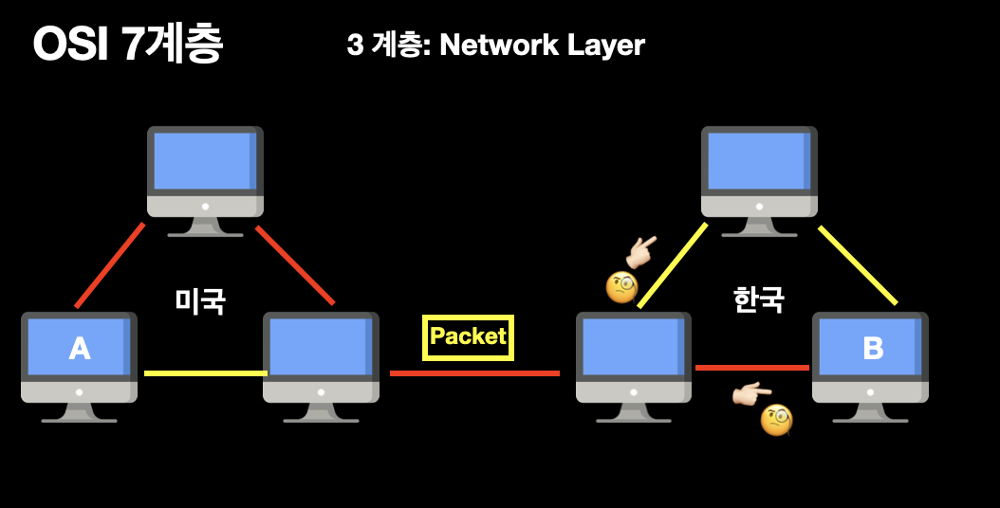

미국에 있는 A가 한국에 있는 B에게 데이터를 보낼 땐 어떻게 할까?
이것에 대해 다루는 것이 3계층, `네트워크 계층`이다.
> 네트워크 계층은 전송할 데이터를 여러개의 경로를 거쳐 목적지에 전송하는 계층이다.

이 계층에서 전송단위는 `패킷`이라 부른다.
즉 주소(IP)를 정하고 경로를 선택하고, 패킷을 전달하는 것이 이 계층에서 이루어지고, 이것을 `라우팅`이라 한다. 라우팅은 네트워크에서 `패킷`을 보낼 때 목적지까지 갈 수 있는 여러경로 중 한 경로를 설정해주는 과정이다.

### 4계층 (Transport Layer)

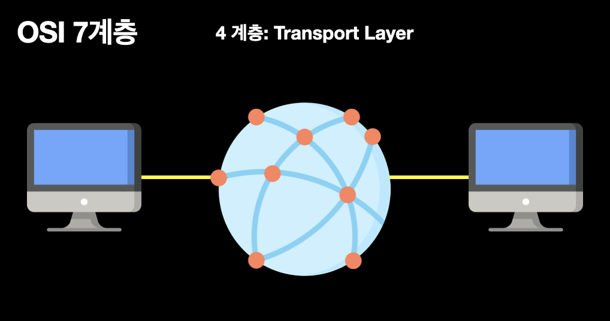

이제 우리는 모든 데이터를 송수신할 수 있게 되었다. 하지만 데이터를 주고 받는다고 끝은 아닐 것이다.
> 4계층, Transport 계층에서는  사용자들이 신뢰성있는 데이터를 받을수 있도록 전송 속도를 조절하거나, 오류가 발생하면 맞춰주는 역할을 한다.

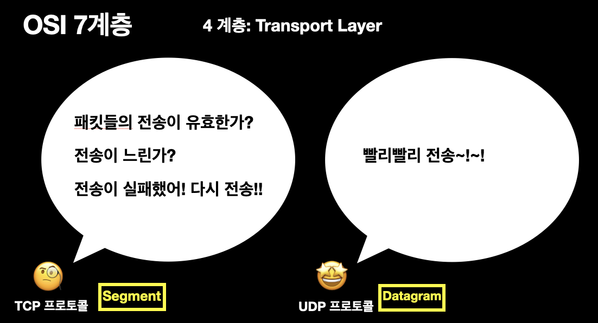

대표적으로 `TCP 프로토콜`과`UDP 프로토콜`이 있다.

`TCP 프로토콜`은 **신뢰성있는 통신을 보장**하고, 신뢰성있는 연결과 전달을 보장하는만큼 계속 연결을 유지해야 해서 그만큼의 리소스가 더 들어간다.
	
반대로, `UDP 프로토콜`은 **빠른 데이터 전송에 초점**을 뒀다. 목적지에 데이터가 제대로 도착했는지는 상관하지 않는다. 따라서 신뢰성있는 데이터 전송보다 스트리밍과 같은 연속적인 특성을 가진 서비스에 UDP 프로토콜이 적합하다고 할 수 있다.

## OSI 1 ~ 4 계층 복습

### 1계층 (Physical Layer)

이 계층에서는 주로 `전기적 신호`를 이용해 통신 케이블로 데이터를 전송하게 된다. 
이 계층에서 사용되는 통신 단위는 `비트`이며 이것은 1과 0으로 나타내어지는, 즉 전기적으로 On, Off 상태를 표현한다. 1계층의 장비로는 `케이블, 리피터, 허브`가 있다.

### 2계층 (Data Link Layer)

데이터 링크 계층은 `직접적으로 연결`된 두 개의 노드 사이에 데이터 전송을 가능하게 하고, `Pysical 계층`에서 발생한 오류를 수정하기도 한다. 이 계층에서 전송되는 데이터 단위는`프레임`이라 부른다. 2계층의 장비로는 `브리지, 스위치`가 있다.

### 3계층 (Network Layer)

라우팅은 네트워크에서 `패킷(데이터 전송 단위)`을 보낼 때 목적지까지 갈 수 있는 여러경로 중 한 경로를 설정해주는 과정으로, Network Layer에서 대부분의 라우팅이 작동한다. 3계층의 장비로는 `라우터, L3 스위치`가 있다.

### 4계층 (Transport Layer)

4계층, `Transport 계층`에서는 보내고자 하는 데이터의 용량과, 속도, 목적지를 처리한다. 주로 이용되는 것은 `TCP`와 `UDP 프로토콜`이다. 4계층의 장비로는  `L4 스위치`가 있다. L3와의 차이점은 3계층에서 온 트래픽을 분석해 서비스 종류를 구분한다.

### 5계층 (Session Layer)
Physical Layer(1계층) ~ Transport Layer(4계층)의 주된 기능은 데이터를 전달하는 것이다. 
5계층부터는 데이터를 송수신하는 양쪽 종점 컴퓨터 내의 `프로세스들 간의 통신 프로토콜`이라 할 수 있다. 

**🧐 세션**
- 1.네트워크 환경에서 사용자 간 또는 컴퓨터 간의 대화를 위한 <u>논리적 연결</u>
    - `물리적 연결`: 케이블을 통해 직접 연결되는 통신
    - `논리적 연결`: 물리적 연결 외에 IP(논리주소), MAC address(물리주소) 등을 통해 통신
- 2.프로세스들 사이에 통신을 수행하기 위해서 메시지 교환을 통해 서로를 인식 한 이후부터 통신을 마칠 때까지의 기간.

세션 계층(Session Layer, 5계층)에서는 `응용 프로그램 간의 통신`을 하기 위한 세션을 운영체제를 통해 확립, 유지, 중단하는 작업을 수행한다. 즉, 응용 프로그램들 간의 접속을 설정, 유지하고 끊어질 경우 데이터를 재전송하거나 연결을 복구한다.

**🧐 동기화**

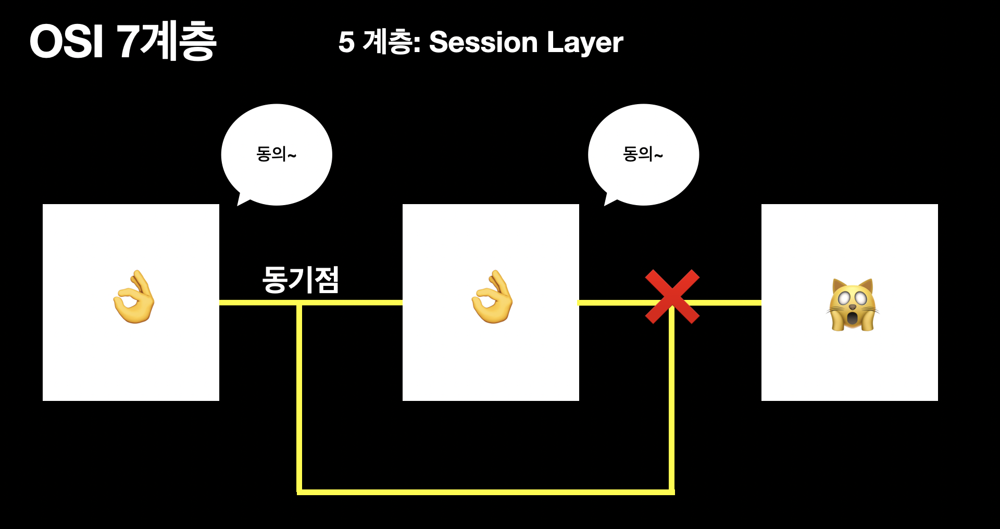

세션계층의 중요한 기능에는 `동기화`가 있다. `동기`란 통신 양단에서 서로 동의하는 논리적인 공통처리 지점으로써, 동기점을 설정하기 위해 사용된다. 동기점이 설정된다는 의미는 그 이전까지의 통신은 서로 완벽하게 처리했다는 것을 뜻한다. 이를 통해 송수신 중 오류가 발생하면, 처음부터가 아닌 동기화 이후부터 다시 재전송한다.  💕

- 예시)
우리는 로그인을 통해 다양한 응용프로그램과 세션을 이루면서 데이터를 주고받는다. 여러 프로그램에 동시에 로그인할 수도 있으며 로그아웃할 때까지 통신관리 및 동기화가 이루어진다. 

#### 세션 계층 역할 요약
- 사용자 위주의 논리적인 연결 서비스 제공
- 전송모드 설정 (반이중, 전이중, 단방향, 병렬, 직렬, 동기, 비동기)
- 대화와 동기를 위한 데이터 교환 관리
- 토큰 (Token: 특정 서비스 요구 권리)  

### 6계층 (Presentation Layer)
`Presentation 계층`은 `7계층(Application Layer)`에서 넘겨받은 데이터를 `Session Layer(5계층)`이 다룰 수 있는 데이터로 바꾸고, 반대로 `Session Layer`에서 넘겨받은 데이터를 `Application Layer`가 이해할 수 있는 형태로 바꾸고 전달한다. 또 그러한 데이터를 안전하게 사용하기 위해 `암호화 / 복호화`도 진행한다. 

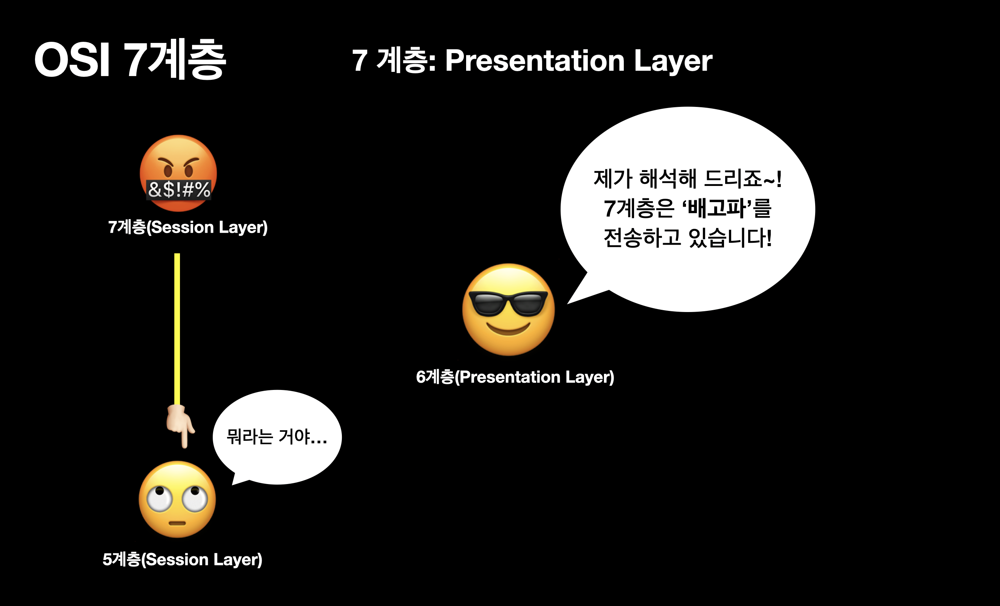

즉, 사용자들이 상위나 하위계층에서 사용하는 `데이터 표현양식과 무관하게` 사용할 수 있도록 해주는 환경을 제공한다. 

- 예시)
EBCDIC로 인코딩된 문서 파일을 ASCII로 인코딩된 파일로 바꿔 주기,  
해당 데이터가 TEXT인지, 그림인지, GIF인지 JPG인지의 구분해주기.

### 7계층 (Application Layer)
응용 계층(Application layer)은 유저와 가장 가까운 층으로, 응용 프로세스(크롬이란 웹 클라이언트에 접속해)와 직접 관계해 일반적인 응용 서비스(HTTP 프로토콜 등)를 수행한다.

#### 응용 계층 역할 요약
 전송된 메일, 사진, 동영상 등이 크롬이나 사파리 등의 `응용프로그램`을 통해 사용자가 눈으로 확인할 수 있는 과정이며, 이 데이터들은 해당되는` 프로토콜(HTTP, FTP, SMTP 등)`에 의해 처리된다.

예시)
- `HTTP`라는 `Application Layer의 프로토콜`은 응용 프로그램인 웹이나 브라우저에 필요한 데이터를 송수신할 때 사용한다.
- `FTP`는 파일 전송 프로토콜로 서버와 클라이언트 사이의 파일을 주고 받을 때 사용한다.

# 💊 데이터 캡슐화
**데이터를 보낼 때는** 7계층 👉🏻  1계층으로 간다. 이 과정에서 캡슐화를 하게 되는데 각 계층은 다른 계층과 통신할 때 데이터에 특정 정보가 들어있는 `Header 와 Footer` 를 추가한 후 다른 계층으로 전달한다. 

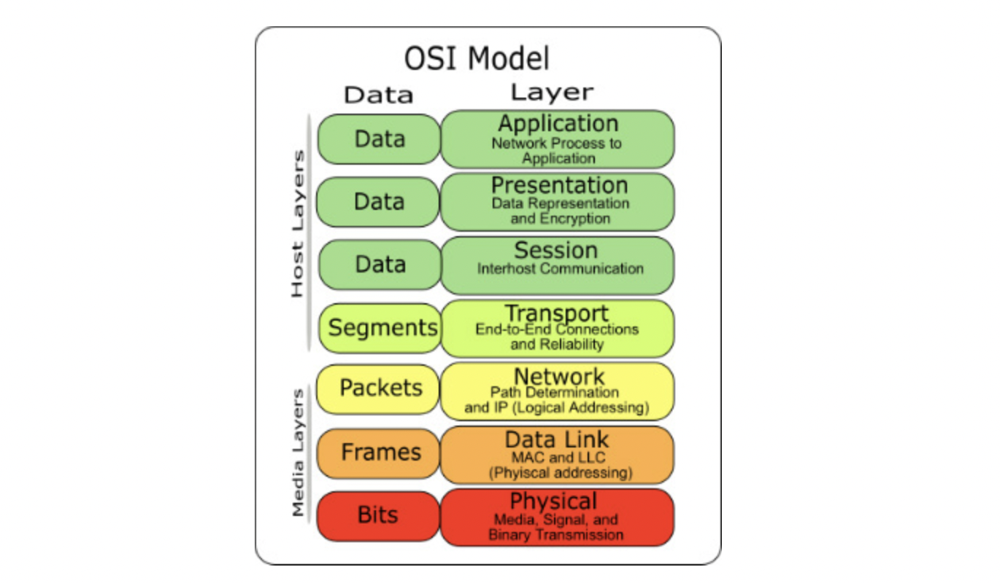

`PDU(Protocol Data Unit)`은 프로토콜 데이터 단위이며 OSI 모델의 정보 처리 단위이다.(2계층의 데이터 PDU는 프레임) 아래 계층으로 내려갈수록 PDU 에는 다양한 프로토콜에 의해 **Header 와 Footer 가 더해진다**. 반대로 데이터를 받은 컴퓨터가 PDU로부터 프로토콜의 Header 와 Footer 를 분석하며 올라가 마지막 **응용 계층에 도달하면 원본 데이터만 남는다**.

# ⤿ 총 흐름
> 이메일을 보내는 과정

1. 작성된 메세지는 `Application 계층(7계층)`에서 `Presentation 계층(6계층)`으로 전달하게 된다.
 

2. `Presentation 계층(6계층)`에서는 전달된 메세지를 데이터로 변환 하거나, **암호화 또는 압축**을 수행한다. 이렇게 변한된 데이터는 `Session 계층(5계층)`으로 전달되게 된다.
 

3. `Session 계층(5계층)`으로 전달된 데이터는 **동기화**를 위하여 주기적으로 `동기점(sync)`을 삽입하여 `Transport 계층(4계층)`으로 데이터를 전달하게 된다.
 

4. `Transport 계층(4계층)`에서는 **발신지와 목적지**를 정하고 **연결 방식**을 연결성, 비연결성 방식으로 설정하여, **흐름 제어와 오류 제어** 기능을 한다. 데이터 단위를 `Segment` 또는 `Datagram`으로 나눈다. 만약에 악성코드가 있을 경우 방화벽이 작동을 해서 걸러준다.
 

5. `Network 계층(3계층)`에서 **라우팅**에 필요한 노리 주소를 설정하고, 패킷에 대한 라우팅 정보를 삽입한다.
 

6. `Data Link 계층(2계층)`에는 우선 `Frame` 단위로 데이터를 나눈다. 그리고 MAC 주소로 지정을 하고 속도 차이를 원할히 메꾸기 위해서 흐름 제어를 한다. 
 

7. `Physical 계층(1계층)`에는 전송 매체가 일반 케이블인지 광케이블인지 메체의 길이를 설정한다. 그리고 데이터를 `회선`으로 보내기 위해 **전기적인 변환**을 담당한다.

# OSI 7계층 and TCP/IP

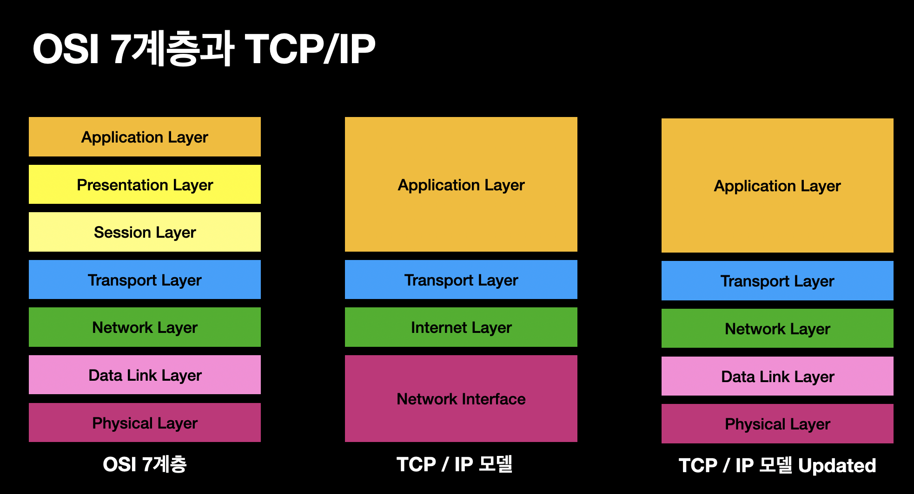

`TCP/IP Protocol Suite`: 인터넷에서 컴퓨터들이 서로 정보를 주고받는 데 쓰이는 프로토콜의 모음이다. 인터넷 프로토콜 중 TCP와 IP가 가장 많이 쓰이기 때문에 이름이 지어졌다. 두 계층다 부분적으로 차이를 보인다.

`OSI 7계층`은 장비 개발, 통신 자체에 대한 표준으로 사용되지만, 실제 통신 자체는 보통 `TCP/IP`를 사용한다. TCP/IP는 OSI보다 먼저 개발되었으며, 지속적으로 표준화되어 신뢰성이 우수하다. 

## 참고 사이트
 - [네트워크 기초 - OSI 7계층과 TCP/IP 계층](https://snyung.com/content/2020-08-31--네트워크-기초-OSI-7-계층과-TCP-IP-계층)
- [OSI 7 계층이란?, OSI 7계층을 나눈 이유](https://shlee0882.tistory.com/110)
- [KSA 한국 표준협회 | 주요 국제표준화기구](https://www.ksa.or.kr/ksa_kr/942/subview.do)
- [OSI 7계층 모형](https://hleee.medium.com/osi-7-계층-모형-72019882b01f)
- [네트워크 통신 계층: OSI 7계층 바로 알기](https://www.sharedit.co.kr/posts/7482)
- [네트워크 OSI 7 계층: 물리계층](https://jhnyang.tistory.com/373)
- [10분 데코톡 | 히히의 OSI & Layer](https://www.youtube.com/watch?v=1pfTxp25MA8&t=1905s)
- [네트워크 / Network / CCNA, 네트워크 개요](https://scene978.tistory.com/entry/네트워크-Network-CCNA-네트워크-개요)
- [OSI](http://www.incodom.kr/OSI#h_d60201395b45707f84e7e65464da075f)
- [세션 계층](https://ko.wikipedia.org/wiki/세션_계층)
- [OSI 계층별 개념(세션 계층과 표현 계층과 응용계층)](https://m.blog.naver.com/PostView.naver?isHttpsRedirect=true&blogId=ttochid1&logNo=10037450926)
- [OSI 7계층(Layer)](https://real-0ne.tistory.com/80)
- [인터넷 프로토콜 스위트](https://ko.wikipedia.org/wiki/인터넷_프로토콜_스위트)

 
