## 실행컨텍스트의 정의

- 자바스크립트 코드가 실행될 때 생성
- 실행에 필요한 정보를 포함
- 자바스크립트 엔진이 물리적 객체로서 다룬다.

 
 

## 실행컨텍스트의 종류

### 전역 컨텍스트

- 자바스크립트 코드가 로드될 때 생성
- 전역 객체를 생성하고 `this`에 전역객체를 바인딩
- 프로그램에 유일하게 존재

 

### 함수 컨텍스트

- 함수가 실행될 때 생성
- 함수의 실행 순서대로 생성되어 콜스택에 쌓임

 

### eval 컨텍스트

- `eval` 함수 내부의 코드로 인해 생성
- 요즘은 잘 사용하지 않는다.

 
 

## 실행 컨텍스트의 구성요소

다양한 구성요소들이 있지만 그 중에서도 Variable Environment에 집중해서 살펴보자

### Varibale Environment

1. Environment Record
2. Outer Environment Reference
3. This Binding

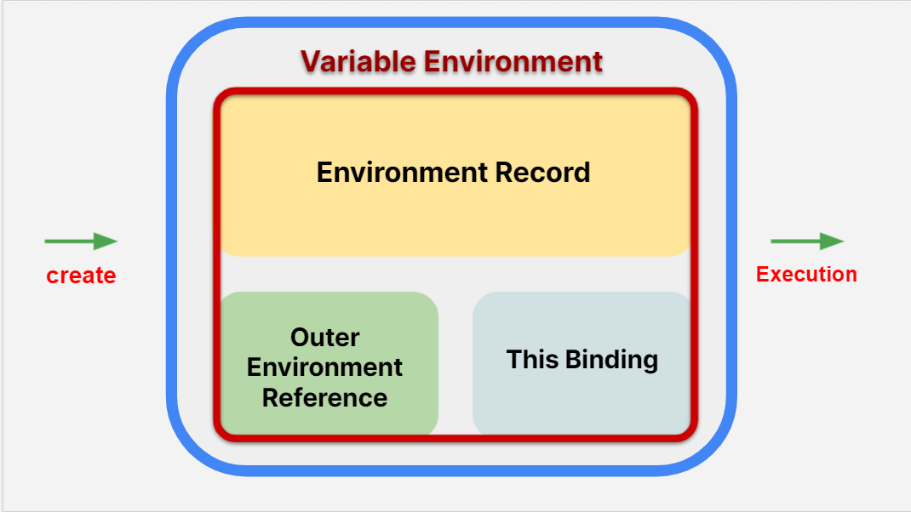

 

#### 1. Environment Record

- 식별자와 변수, 식별자와 함수의 매핑을 담당

- 생성 단계: var로 선언된 변수의 식별자, 매개변수의 식별자, 함수코드를 수집
- 실행 단계: 식별자에 값을 할당, 함수가 호출시 함수 실행

#### 2. Outer Environment Reference

- 해당 컨텍스트에 식별자 부재시 외부 환경을 참조

#### 3. This Binding

- this에 해당하는 객체를 명시

 
 

## 실행컨텍스트의 생성과 실행

### 생성 단계

#### Environment Record

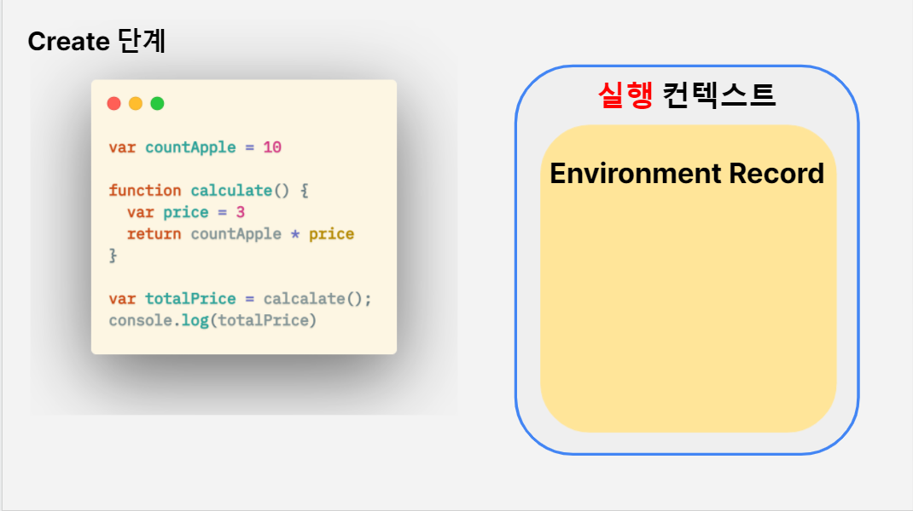

자바스크립트 코드가 로드될 때 전역 컨텍스트가 생성

 
 

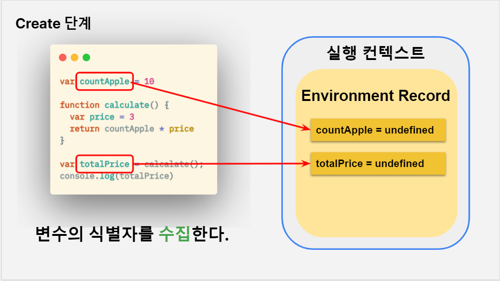

변수의 식별자를 **수집**한다

- `var`로 선언된 변수는 `undefined`로 설정
- `let`, `const`로 선언된 변수는 `uninitialized`로 설정

 
 

함수 코드를 수집한다. 단 함수는 코드 전체를 수집한다.

 

#### Outer Environment Reference

- 전역 컨텍스트에서는 없음
- 함수 컨텍스트가 생성될 때 함수가 **선언**된 Variable Env를 참조

 

#### This Binding

- 전역 컨텍스트는 전역 객체를 생성하며 `this`에 전역 객체를 바인딩
- 함수 컨텍스트는 호출 방법에 따라 다름

  1. 객체의 메서드로 호출시 `this`에 해당 객체 바인딩
  2. 일반 함수로 호출시 `this`에 전역 객체 또는 `undefined`(엄격모드) 설정

 
 

### 실행 단계

1. 자바스크립트 코드가 로드되면 전역 컨텍스트가 **생성**되어 콜스택에 쌓인다.

   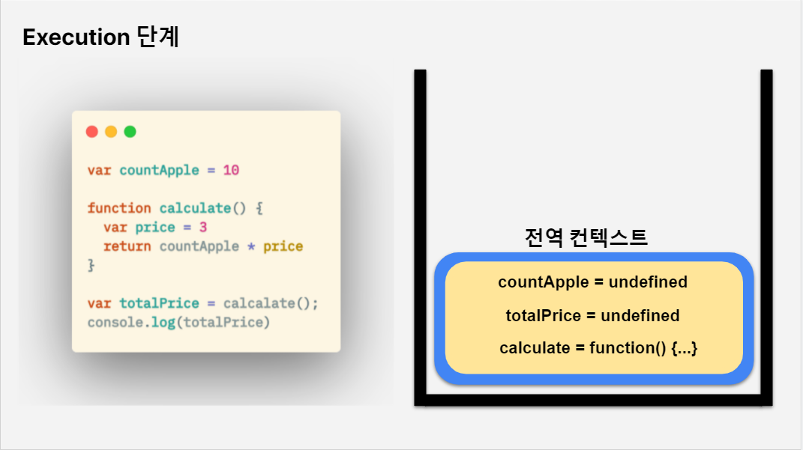

 
 

2. 변수의 식별자를 만나면 해당 값을 할당한다.

   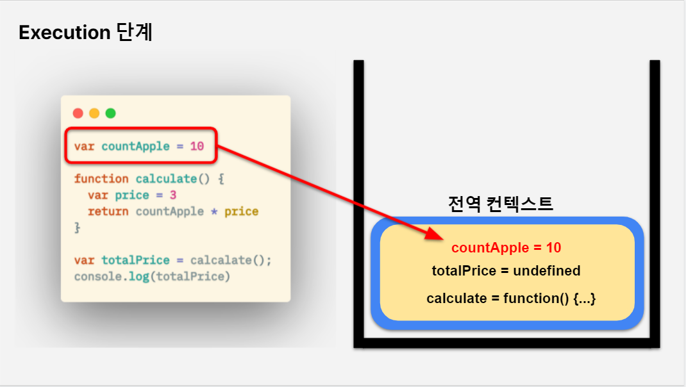

 
 

3. 함수코드는 이미 수집했기 때문에 무시하고 넘어간다.

   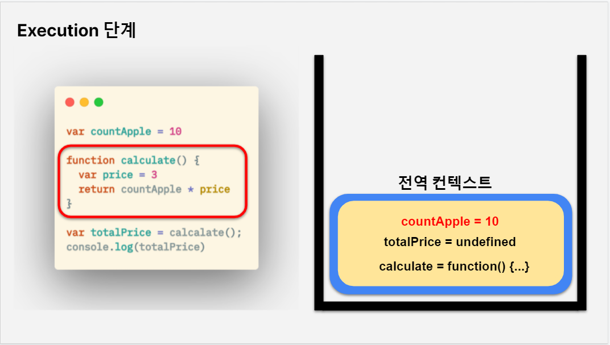

 
 

4. 함수 실행코드를 만나면 함수의 식별자가 해당 함수를 호출한다.

   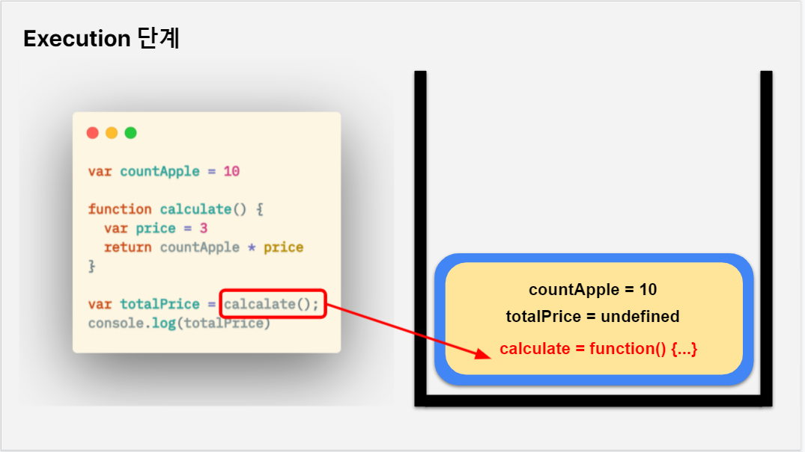

 
 

5. 함수 컨텍스트가 생성되어 콜스택에 쌓인다.

   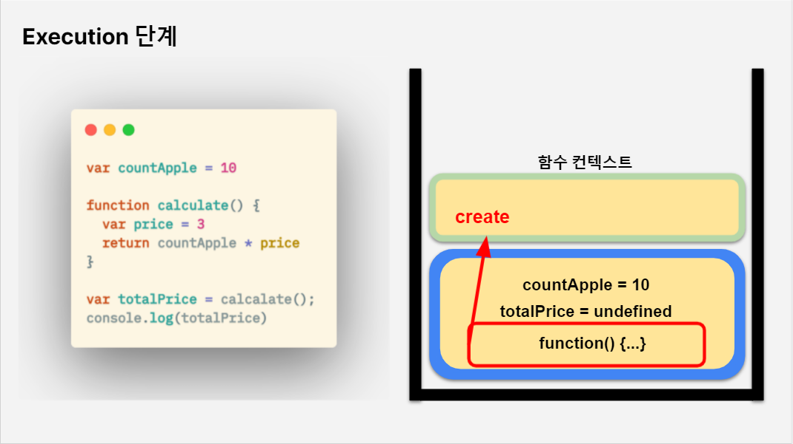

 
 

6. 앞서 설명한 컨텍스트 생성단계를 거친다.

   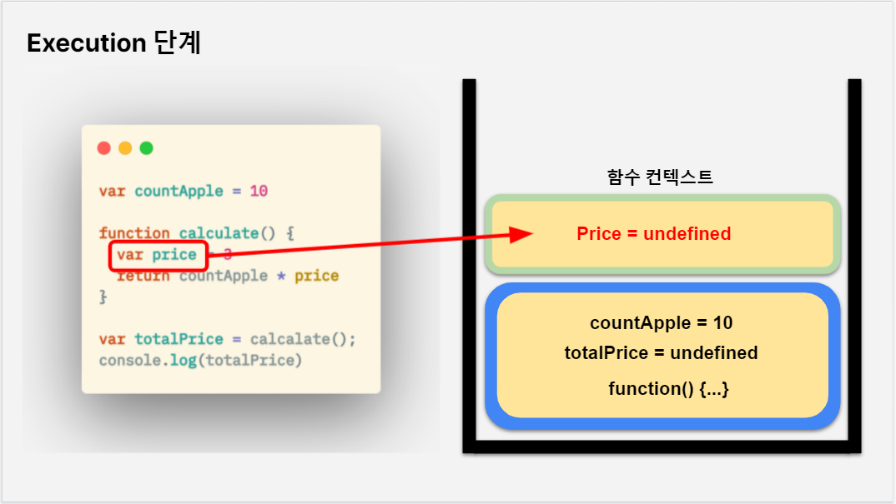

 
 

7. 생성 단계가 마무리되면 실행단계가 시행된다.

   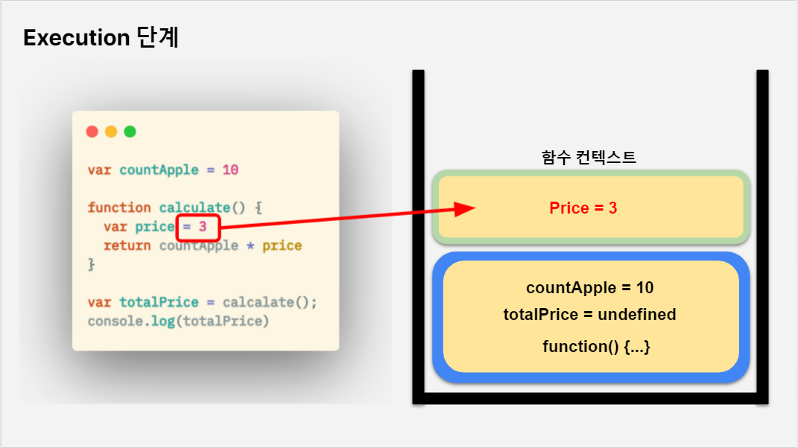

 
 

8. 해당 Environment Record에 없는 식별자를 만나면 OuterEnvRef를 통해 외부 환경을 찾는다.

   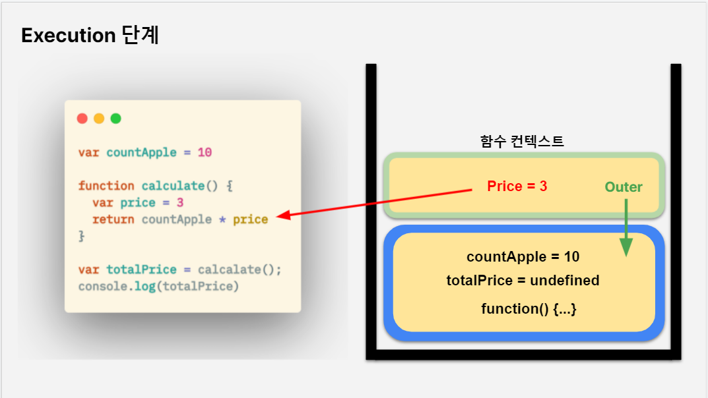

 
 

9. 외부 환경에서 식별자에 할당된 값을 찾는다.

   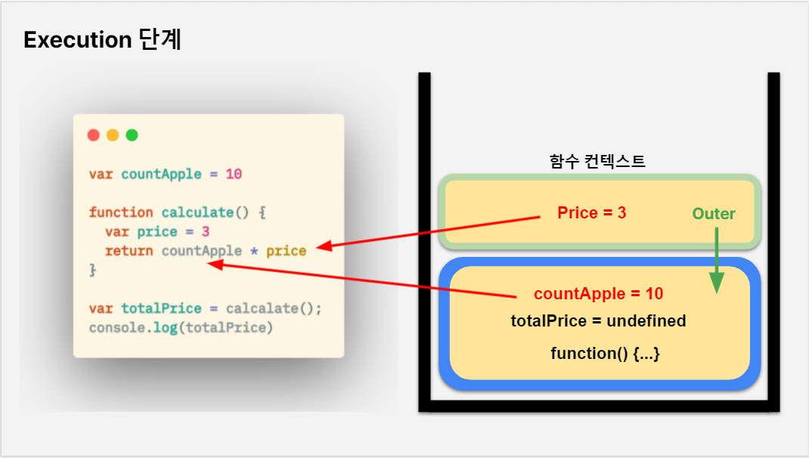

 
 

10. 실행이 마무리 된 함수 컨텍스트는 콜스택에서 pop되고 다시 전역 컨텍스트가 실행된다.

    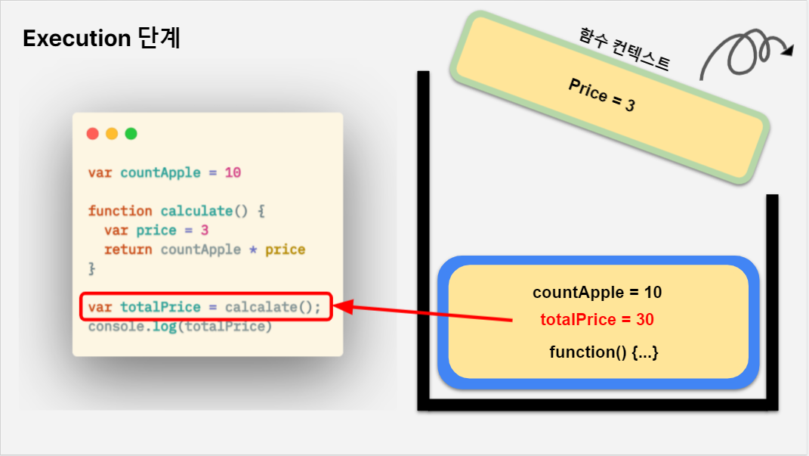

 
 

11. 모든 실행이 마무리되면 전역컨텍스트가 pop되고 프로그램이 종료된다.

    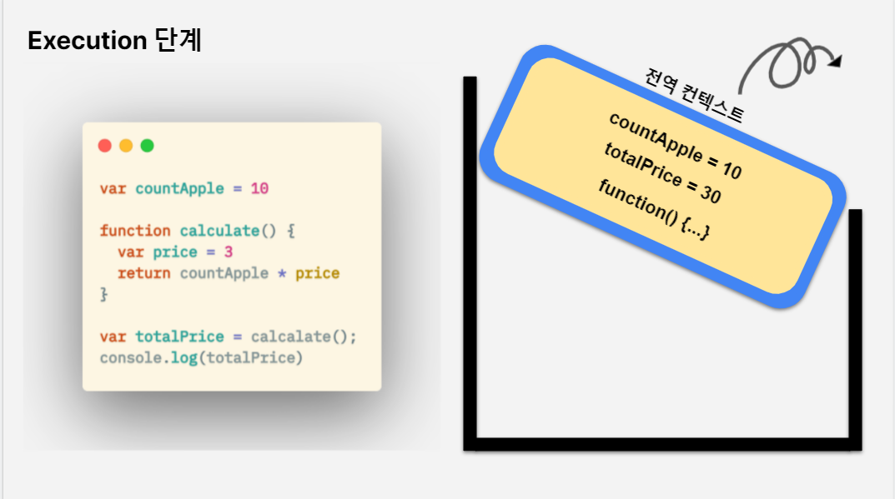

## 정리

**1. 실행 컨텍스트는 생성단계와 실행단계를 반복하며 update된다.**

**2. 변수의 수집과 할당은 각각 다른 단계에서 이루어진다. -> 호이스팅 현상 발생**

**3. 해당 실행컨텍스트에서 변수를 찾을수 없다면 외부환경에서 찾는다. -> 스코프 체인**

**4. 실행 컨텍스트 생성시 생성 방법에 따라 this가 명시된다.**
