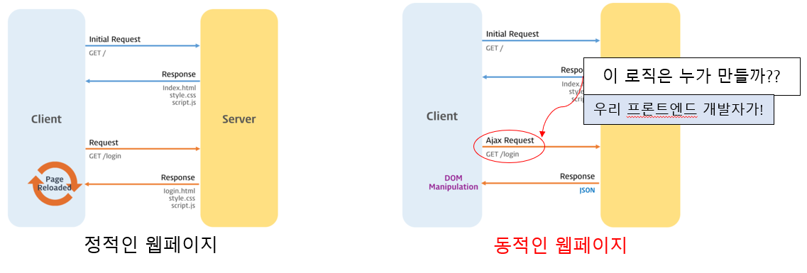

# HTTP 요청 헤더의 종류와 기능

## HTTP 헤더란

- HTTP 통신의 헤더(상단)에 표기된 정보로, 통신에서 요청(Request)와 응답(Response)의 부가적인 정보를 (함축하여) 전송할 수 있도록 해준다.

- General Header
- Request Header
- Response Header
- Entity Header
  로 그룹화 할 수 있다

## 프론트엔드 개발자는 왜 HTTP (특히 요청) 헤더를 알아야 할까?

- 현대의 웹페이지는 동적이다.
  => 웹페이지를 불러올때만이 아니라 이후에도 클라이언트와 지속적인 통신(AJAX)이 이루어 질 수 있다.
- AJAX 통신을 통해 Client - Server 가 정보 요청-응답이 이루어진다고 했을때, AJAX 통신 로직은 javascript를 통해 작성되어진다. 즉, 클라이언트 사이드, 프론트엔드에서 해당 로직을 구현해야만한다. 이때 Server측에 알맞는 정보요청을 하기위해선, HTTP, HTTP헤더의 종류와 기능을 알고 있어야한다.
  

## HTTP 요청 헤더의 종류

1. Host
2. User-Agent
3. Referer
4. Accept
5. Cookie
6. If-Modified-Since
7. Authorization
8. Origin

### 1. Host

- 서버의 도메인명을 표기한다. 이때 옵션으로, TCP 포트번호 또한 표기가능하다.
- 모든 HTTP/1.1 요청 헤더에 포함되어있어야 하는 헤더
- 만일 포함되어있지 않거나, 복수의 필드를 포함하는 경우 400(Bad Request) Status Code를 받게 되어 통신이 이루어지지않는다.

### 2. User-Agent

- 클라이언트 측의 소프트웨어(브라우저, OS) 및 버전 정보가 String으로 기록된다.
- `사용자 디바이스별로 다른파일을 제공해야할때 활용 가능할듯 하다.(자동으로 운영체제에 맞는 드라이버 업데이트 파일 제공)`

### 3. Referer

- 현재 요청된 페이지 이전의 웹 페이지 주소를 포함한다.
- 사용자가 어느 페이지에서 유입되었는지 알 수 있다. ( 다만 조작 가능)
- `유입경로를 확인하여 광고효능을 평가하거나, 다양한 기능에 활용 가능할듯하다. JavaScript를 통해서도 뒤로가기 기능이 구현가능하지 않을까`

### 4. Accept

- 클라이언트 측에서 이해 가능한(또는 원하는) 컨텐츠 타입이 무엇인지 MIME 타입으로 표현
  (image/png, audio/mp3, font/ttf ...)
- 복수의 MIME 타입을 요청할 수 있고, ;q=를 통해 선호 순서를 매길수 있다.
  (image/png;q=0.9, image/jpeg;q=0.7)
- `동적인 이미지 요청 등 다양한 데이터요청에 활용 가능할듯하다`

### 5. Cookie

- Set-Cookie 헤더를 포함하여 클라이언트 측에 저장되어 있는 cookie값들을 포함한다.
- 이때 쿠키는 사용자측에서 선택적으로 포함시킬 수 있으며, 브라우저의 privacy settings에 따라 쿠키 전송을 막을 수 있다.

### 6. If-Modified-Since

- 날짜를 지정하여 서버측에 요청, 서버는 전송할 데이터가 지정된 날짜 이후에 수정 되었을 경우에만 데이터를 보내준다.
- 날짜 이후 수정되지 않았다면 304(not-Modified) 응답이 이루어진다
- `새로고침을 할때라던가, 이미 클라이언트측에 데이터가 있을경우 무의미한 통신낭비를 줄일 수 있다`

### 7. Authorization

- 서버의 사용자임을 증명하는 자격을 포함시킨다.
- JWT와 같은 인증 토큰을 서버로 보낼 때 사용되는 헤더

### 8. Origin

- 서버로 POST 요청을 보낼 때, 요청이 시작 된 주소를 포함한다.
- 이때 요청을 보낸 주소(Host)와 받는 주소(Host)가 다를경우, CORS 에러가 발생된다.
- 응답 헤더의 Access-Control-Allow-Origin과 관련되있다
- `원활한 프론트엔드-백엔드 통신에 있어서 굉장히 중요한 요소다! CORS에 대해 심층적인 조사가 필요하다`

## 결론

앞서 말했듯, 가장 기본적으로 클라이언트-서버간에는 HTTP 통신을 통해 데이터를 주고받는다. 그리고 이는 AJAX(XMLHttpRequest)를 통한 통신 또한 마찬가지이다. 근래의 웹페이지와 같은 동적인 웹페이지를 제작하기 위해선, 프론트엔드의 클라이언트-서버와의 통신에 대한 이해는 필수불가결하다. 그중의 핵심 도구가 될수 있는 HTTP헤더의 종류와 기능을 파악하는것은 앞으로 개발을 하는데 있어 많은 도움을 줄것이다.

## 참조

- HTTP 와 Ajax :
  https://rootjang92.github.io/2019/01/26/httpAjax/

- HTTP 헤더 종류:
  https://developer.mozilla.org/ko/docs/Web/HTTP/Headers
  https://goddaehee.tistory.com/169
  https://www.zerocho.com/category/HTTP/post/5b3ba2d0b3dabd001b53b9db
