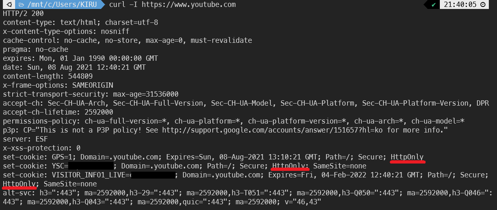
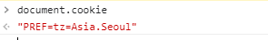

# XSS 공격과 이를 방지하기 위한 쿠키의 대책 HttpOnly

## XSS(Cross Site Scripting)이란 무엇일까?

- 서버 측에서 제공되는 Script가 아닌 권한이 없는 사용자(이하 해커)가 웹사이트에 Script를 삽입하여 의도치 않은 동작을 일으키는 공격
- 주로 JavaScript로 작성된 Script를 통해 공격이 가해진다.

### XSS 공격에 대응하기 위한 다양한 방법

- XSS 방어 라이브러리 (ex>nodejs express의 helmet)
- 브라우저 확장앱
- 웹 방화벽
- Set-Cookie의 HttpOnly, SameSite, Secure ...

> tmi : CSS와 동일한 이니셜로 인해 XSS라는 명칭을 갖게 되었다고한다.

## XSS 공격 종류

### 1. Stored(Persistent) XSS (저장형(또는 지속형) XSS)

- 게시글, 메일과 같이 사용자가 텍스트를 작성하여 데이터베이스에 저장되는 페이지에서 사용

1.  HTML이 작성가능한 곳에 악성스크립트 삽입
2.  악성스크립트가 삽입된 URL을 User가 열람
3.  삽입된 Script가 실행

### 2. Reflected XSS (반사형 XSS)

- 검색창과 같이 사용자가 입력한 검색어가 표시되어지는 페이지에서 사용 (ex> 유튜브, 구글검색 등 ...)

1.  HTML이 작성가능한 곳에 스크립트를 작성하여 표시되는 URL을 User에게 전달
2.  해당 URL을 User가 열람
3.  삽입된 Script가 실행

### 3. DOM based XSS (DOM 기반 XSS)

- URL에서 #이후에 입력받은 값은 서버측에 전송되지 않는점을 이용하여 공격하는 방식. 해당 방식은 서버측에서 Script를 필터링할수 없다(브라우저에서 필터링).

1. URL 속에 script를 삽입 (http://www.test.com/page.html#default=<script>alert("XSS공격")</script>)
2. 해당 URL을 User가 열람.
3. URL속 삽입된 Script가 실행

### !! 클라이언트(유저) 측의 데이터를 탈취당한다면..?

- 위와 같은 방식으로 해커는 클라이언트(유저)측에서 접속하는 브라우저에서 해커가 작성한 Script를 실행시킬수있다. 유저 측에서 작동되는 Script는 굉장히 위험하다. 유저가 로컬에서 갖고있는 데이터들이 조작,변조,탈취 당할 수 있기 때문이다. 그리고 탈취당할 수 있는 데이터들 중에는 Cookie도 해당된다.

## 웹에서의 Cookie의 기능

- 클라이언트(유저) 측에서 저장, 관리되는 데이터로
  클라이언트 -> 서버로 Cookie를 통해 다얗한 정보가 제공되어 질수 있다. - 위치정보, 세션ID를 통한 사용자식별: 세션쿠키, 방문횟수, 유입된 경로 등

- 이러한 정보들을 통해 서버는 클라이언트에 맞게 알맞는 정보,데이터를 제공해줄 수 있는등 보다 유저친화적(?)인 웹사이트를 제공가능하다.
  - 팝업차단,지속적인 로그인 정보갱신, 장바구니 저장, 위치에 따른 정보 탐색 등

> 세션쿠키를 이용한 개인식별 절차
>
> 1. 클라이언트(브라우저)가 서버에 접속
>
> 2. 서버에서 세션 ID(개인식별자)를 set-cookie를 통해 > 클라이언트에 전달. 클라이언트는 이를 저장
>
> 3. 해당 브라우저가 세션쿠키를 보관하며 사용자 인증(로그인)
>
> 4. 사용자 편의를 위해 클라이언트측에서 동일 세션쿠키를 전달하면 > 서버는 로그인이 지속되고 있는것으로 간주
>
>    -> 여기에서 세션쿠키를 탈취당한다면…? **해커가 사용자사칭 가능**

### XSS 공격을 통한 Cookie 탈취

- 기본적으로 cookie는 JavaScript를 통해 조회가 가능하다
  ```javascript
  document.cookie = "Cookie Key:Cookie Value";
  ```
- 그렇기 때문에 클라이언트에 저장되있는 cookie 데이터 또한 XSS공격을 통해 탈취가 가능하다.

## Cookie의 대응방안 (중에하나) ! HttpOnly

- 서버측에서는 HTTP 응답 헤더로서 Set-Cookie를 통해 클라이언트 측에 쿠키를 생성하도록 요청할 수 있다.
- 이때, Set-Cookie에는 다양한 Attrubtes을 통해 이 쿠키에 옵션을 부여할 수 있는데, HttpOnly도 그중에 하나이다.

### HttpOnly 의 기능

- 간단하다. 바로 클라이언트 측에서 HTTP 통신외에는 Cookie에 접근이 불가능하도록 하는것. HttpOnly Attribute를 가진 쿠키는 클라이언트에서 JavaScript를 통해 접근이 금지된다.

  

  서버에서 전송되는 set-cookie. YSC,VISITOR_INFO01_LIVE등의 cookie들이 httponly 옵션을 지닌다.

  

  document.cookie를 통해 해당 cookie값이 조회되지않는다!

### HttpOnly가 가지는 한계점

- [SPA(Single Page Application)](https://dev-dain.tistory.com/46)

  근래의 웹페이지들은 편의성,속도등을 위해 SPA(Single Page Application)로 구현이 되어지고 있다. 이때 SPA는 한 페이지에서 많은 기능들을 수행하기위해 AJAX(Asynchronous JavaScript And XML)를 통해 서버와 통신한다.

- 만약에 [AJAX](https://developer.mozilla.org/en-US/docs/Web/Guide/AJAX/Getting_Started)통신을 할때 cookie의 값을 서버에 전송해야 한다면?

  httpOnly 옵션을 가진 cookie는 JavaScript를 통해 접근하지 못한다. 접근을 하려면 `httpOnly = false`로 하는 수뿐이없다. 하지만 이는 XSS 공격으로부터 취약점이 생겨버리게 된다.

- XST(Cross-Site-Tracing) 공격 [참조](https://webhack.dynu.net/?idx=20161111.001)

  또한 2003년 XST(Cross-Site-Tracing) 공격을 통해 HttpOnly 방어책을 우회할수 있는 방법이 발견되어지며(현재 대부분의 브라우저에서 TRACE를 하지 못하게 되어있어 실현은 불가능하지만) httpOnly 만을 통해 cookie를 XSS공격으로부터 지키기엔 한계가 있다.

---

## 결론 및 요약

- 웹개발 기술은 하루가 멀다하여 진화하고, 변화한다. 마찬가지로 XSS와 같은 공격은 변화할때마다 생기는 허점을 공략할 것이다. 이러한 환경속에서 단 하나의 보안체계를 통해서 모든공격을 막기란 불가능하다. 다만, 공격방식을 알고, 이에 대한 다양한 대처방식들을 이해함으로서 내가 개발하는 웹페이지의 보안체계에 대해 이해하고, 견고히 해나갈수 있을것이다.

1. XSS공격은 페이지에 Script를 삽입하여 클라이언트측에서 해당 Script가 실행되게끔한다.
2. Cookie또한 JavaScript를 통해 조회가 가능하고, 같은 이유로 XSS공격으로 조작,탈취당할수 있다.
3. Set-Cookie Attribute 중 HttpOnly를 통해 JavaScript로 Cookie에 접근하지 못하게 할수 있다.
4. 근래의 웹페이지방식(SPA) 등 AJAX 통신에 있어 제한사항이 있기때문에 사용에 제약이 있다.
5. 서버, 브라우저측에서 Script필터링등을 통한 추가적인 XSS공격이 필요하다.
