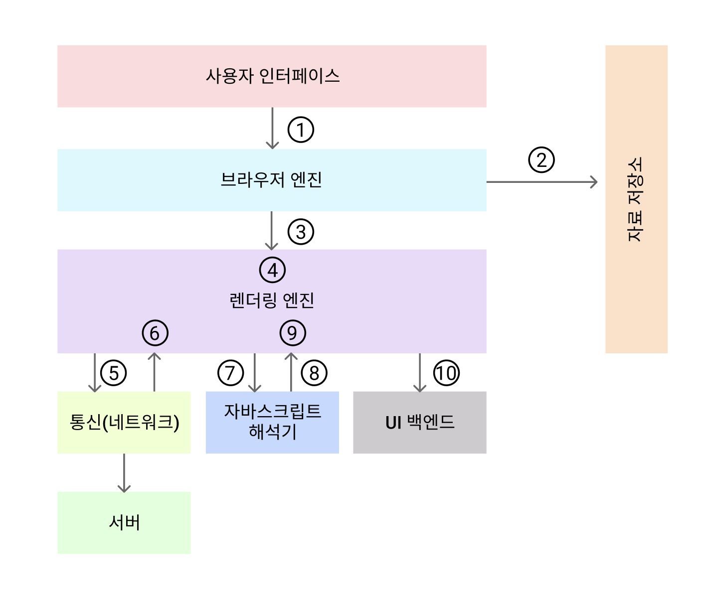
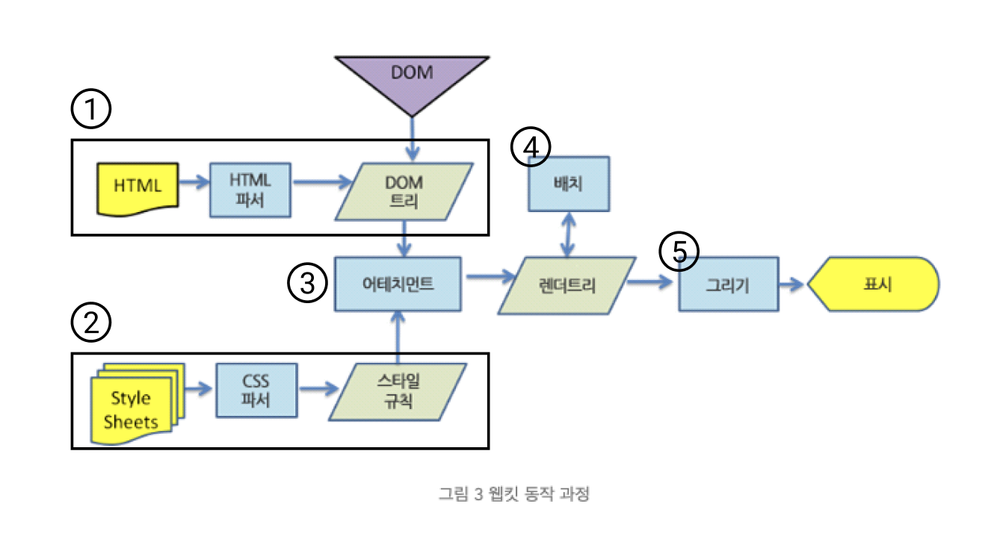
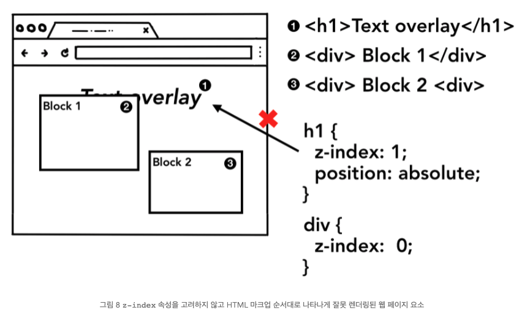
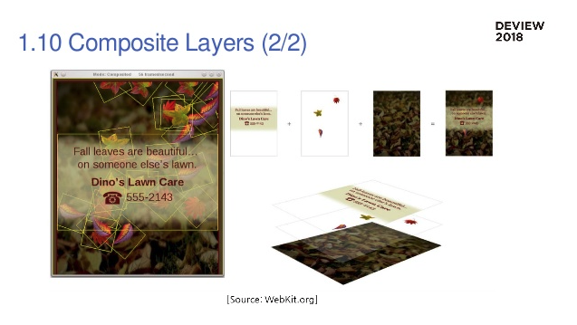

# [스터디] 렌더링 엔진

# 렌더링 엔진이란?

브라우저 동작과정

렌더링 엔진 동작과정

## 렌더링 엔진 특징

- 웹 브라우저마다 사용하는 렌더링 엔진이 다름
(Safari는 Webkit, Firefox는 Gecko, Chrome은 Blink)
- 렌더링 역할을 하는 엔진은 기본적으로 웹표준을 준수하지만,
브라우저마다 다르기 때문에 같은 페이지여도 다르게 보이는 경우가 있다.
**→ 크로스 브라우징을 해야함**
- 크로스 브라우징이란?

    웹 페이지 제작 시, 모든 브라우저에서 깨지지 않고 의도한 대로 올바르게(호환성) 나오게 하는 작업

## 렌더링 엔진의 목표
---
- HTML, CSS, JS, 이미지 등 웹 페이지에 포함된 모든 요소들을 **화면에 보여준다**
- 업데이트가 필요할 때(사용자 동작으로 인한 이벤트, 비동기 요청 등), **효율적으로 렌더링을 할 수 있도록** 자료구조(렌더트리)를 생성한다

# 렌더링 엔진 동작과정

**요약**
1. HTML을 처리하고 **DOM 트리**를 빌드한다. ("무엇을" 그릴지 결정한다.)
2. CSS를 처리하고 **CSSOM 트리**를 빌드한다. ("어떻게" 그릴지 결정한다.)
3. DOM 및 CSSOM 을 **결합(attachment)하여 렌더링 트리**를 형성한다. ("화면에 그려질 것만" 결정)
4. 렌더 트리에서 **레이아웃**을 실행하여 각 노드의 기하학적 형태를 계산한다. ("Box-Model" 을 생성한다.)
5. 개별 노드를 화면에 **페인트**(레이아웃 수치를 변경하지 않는 스타일)한다.
6. 픽셀로 변환하는 작업인 **레이어 합성**을 진행한다.(래스터화)

## Critical Rendering Path
---

> HTML 파싱하며 노드로 만들고 **DOM 트리 구축** = 렌더러 프로세스의 메인스레드 역할

> \<link href="">, \, \<script src="">
→ **프리로드 스캐너가 Network Request를 통해 네트워크 스레드에 요청**
→ 속도를 높이기 위해 메인스레드가 아닌 '프리로드(Preload) 스캐너'가 동시에 실행

> **\<script>태그를 만나면 html파서는 문서 파싱을 일시중지**하고, 자바스크립트 코드를 로딩하고 파싱해 실행해야함
→ \<script> 태그에 **async 속성이나 defer 속성**을 추가, 이 속성이 있으면 브라우저가 JavaScript 코드를 비동기적으로 로딩하고 실행하면서 HTML 파싱을 막지 않는다.

> 메인 스레드는 **CSS를 파싱하고 각 DOM 노드에 해당되는 계산된 스타일(computed style)을 확정**
개발자 도구의 computed 패널에서 이 정보를 볼 수 있다.(CSSOM)

### 작동원리를 이해해야 하는 이유 중 하나가 이 layout, paint 단계를 효율적으로 다루기 위해서!

> 메인 스레드는 DOM과 계산된 스타일을 훑어가며 **레이아웃 트리(렌더 트리)를 만든다.**

> 레이아웃 트리(렌더 트리)는 DOM 트리와 비슷한 구조일 수 있지만 **웹 페이지에 보이는 요소에 관련된 정보만 가지고 있다.** 

- {display: none} 속성이 적용된 요소는 레이아웃 트리(렌더 트리)에 포함되지 않는다
- 그러나 {visibility: hidden} 속성이 적용된 요소는 레이아웃 트리(렌더 트리)에 포함된다
- 이와 비슷하게 p::before{content:"Hi!}와 같은 가상 클래스(pseudo class), 가상요소는 DOM에는 포함되지 않지만 레이아웃 트리에는 포함된다.

## 레이아웃(Reflow)

---

> 레이아웃은 **요소의 기하학적 속성(geometry)를 찾는 과정**
(box-model, xy좌표, 상대적 단위(em) 크기를 계산)

## 페인트(Repaint)

---

> **어떤 순서로 그려야 할지 판단**, DOM에 선언된 노드 순서와 페인트 순서는 많이 다를 수 있다.(ex_z-index)

> 페인트 단계에서 메인 스레드는 페인트 기록(paint record)을 생성하기 위해 레이아웃 트리(렌더 트리)를 순회

## 레스터화, 합성

---

> 정보를 화면의 **픽셀로 변환**하는 작업, **합성 프레임(compositing frame)을 만들어 내는 것**

> 웹 페이지의 각 부분을 **레이어로 분리**해 별도로 래스터화하고 
**컴포지터 스레드(compositor thread)라고 하는 별도의 스레드에서 웹 페이지로 합성**하는 기술
(포토샵의 레이어 개념과 유사)

> 메인 스레드는 레이아웃 트리(렌더 트리)를 순회하며 **레이어 트리**를 만든다

> 레이어가 많으면 합성 비용이 높을 뿐만 아니라 레이어를 메모리에 가지고 있어야 하는 부담도 있다. 
(Chrome은 레이어가 과도하게 많아지는 것(layer explosion)을 막기 위해 특정한 경우에는 레이어를 생성하지 않거나 합치기도 한다.)

> **합성의 이점은 메인 스레드와 별개로 작동할 수 있다는 점**
컴포지터 스레드는 JavaScript 실행이나 스타일 계산을 기다리지 않아도 된다. 
이것이 합성만 하는 애니메이션이 성능상 가장 부드럽다고 보는 이유
레이아웃이나 페인트를 다시 계산해야 할 경우에는 메인 스레드가 관여해야 한다.

# UI가 업데이트 되는 상황

## 레이아웃부터 다시 발생(Reflow)

- 요소의 크기나 위치가 바뀔 때
- 브라우저 창의 크기가 바뀌었을 때 발생

## 페인트부터 다시 발생(Repaint)

- 배경이미지, 텍스트 색상, 그림자 등 레이아웃 수치를 변화시키지 않는 스타일의 변경

## 레이어의 합성만 다시 발생

- 레이아웃, 페인트를 수행하지 않기 때문에 성능상으로 가장 큰 이점을 가짐

> CSS 속성이 변경되었을 때, 어떤 렌더링이 업데이트 됬는지 알 수 있는 사이트
[https://csstriggers.com/](https://csstriggers.com/)

# 렌더링 최적화하기

- 개발자도구 → Performance → 녹화,캡쳐 → 어떤 렌더링 과정이 일어났는지 확인 가능

### 강의 추천(뒷광고 아닙니다ㅎㅎ)

[https://www.inflearn.com/course/웹-성능-최적화-리액트-1#curriculum](https://www.inflearn.com/course/%EC%9B%B9-%EC%84%B1%EB%8A%A5-%EC%B5%9C%EC%A0%81%ED%99%94-%EB%A6%AC%EC%95%A1%ED%8A%B8-1#curriculum)

## 출처, 참고자료

- [https://gist.github.com/faressoft/36cdd64faae21ed22948b458e6bf04d5](https://www.notion.so/36cdd64faae21ed22948b458e6bf04d5)
- [https://d2.naver.com/helloworld/59361](https://d2.naver.com/helloworld/59361)
- [https://d2.naver.com/helloworld/5237120](https://d2.naver.com/helloworld/5237120)
- 우아한테크코스 테크토크-브라우저 렌더링 설명
[https://www.youtube.com/watch?v=sJ14cWjrNis](https://www.youtube.com/watch?v=sJ14cWjrNis)
- [https://www.youtube.com/watch?v=tJieVCgGzhs&list=PLv2d7VI9OotTVOL4QmPfvJWPJvkmv6h-2&index=2](https://www.youtube.com/watch?v=tJieVCgGzhs&list=PLv2d7VI9OotTVOL4QmPfvJWPJvkmv6h-2&index=2)